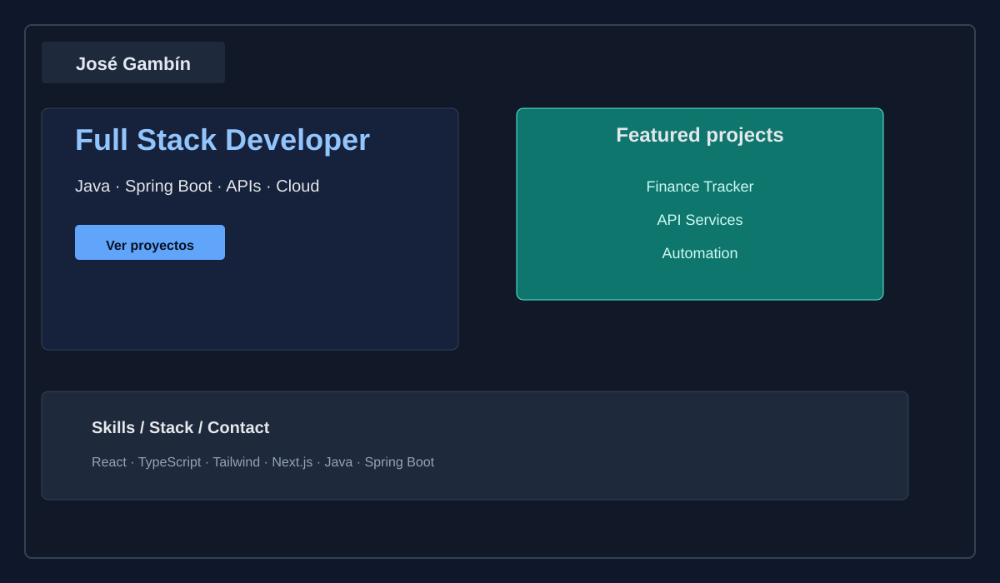
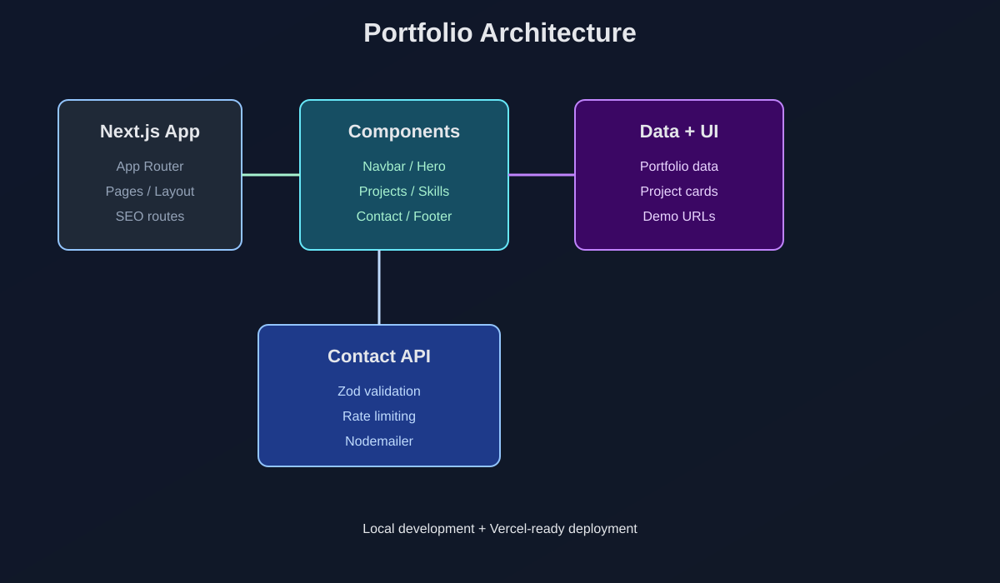

# Portfolio de José Gambín

[](https://nextjs.org/)
[](https://react.dev/)
[](https://www.typescriptlang.org/)
[](https://tailwindcss.com/)
[](https://vercel.com/)

Portfolio personal desarrollado con Next.js, React, TypeScript y Tailwind CSS para presentar la trayectoria profesional de José Gambín como Full Stack Developer, con especialización en Java, Spring Boot, APIs REST, PostgreSQL, automatización, servicios empresariales y arquitectura orientada a despliegues seguros.

<p align="center">
  
</p>

## 📌 Descripción general

Este repositorio contiene el portfolio personal de José Gambín, una web orientada a comunicar su perfil profesional, proyectos destacados, stack tecnológico, experiencia práctica y flujo de contacto. La aplicación está construida con App Router de Next.js, UI visual basada en componentes React y estilos con Tailwind CSS, además de animaciones con Framer Motion.

## 🧭 Arquitectura del proyecto

La solución sigue una estructura orientada a UI modular, datos estáticos y rutas API para contacto:

```text
src/
├── app/                # Rutas App Router, layout global, metadatos y API route
├── components/         # Navbar, Hero, Projects, Contact, Footer y UI reusable
├── data/               # Datos estáticos del portfolio, proyectos y juegos
├── lib/                # Utilidades y helpers compartidos
└── public/             # Recursos estáticos y manifest
```

La arquitectura visual puede resumirse así:

<p align="center">
  
</p>

## 🚀 Stack tecnológico

| Área | Tecnología |
| --- | --- |
| Framework | Next.js 16 |
| Interfaz | React 19 + TypeScript |
| Styling | Tailwind CSS 4 |
| Animaciones | Framer Motion |
| Formularios | React Hook Form + Zod |
| Email | Nodemailer |
| SEO | `robots.ts`, `sitemap.ts` |
| Infraestructura | Vercel-ready / Next.js compatible |

## ✨ Funcionalidades

- Landing page profesional con hero, sobre mí, proyectos y stack.
- Barra de navegación y estructura visual multi-sección.
- Tarjetas de proyectos con enlace de visualización y demo `iframe` embebida.
- Sección de contacto con validación de formulario y envío por API route.
- SEO básico con `robots.ts`, `sitemap.ts` y metadatos del `layout`.
- Integración con Google Fonts y UI compacta con cards, dialogs y layouts responsivos.

## 🧪 Requisitos previos

Antes de ejecutar el proyecto, asegúrate de tener instalado:

- Node.js 20 o superior
- npm
- Una cuenta Gmail con contraseña de aplicación para el envío del formulario de contacto

## ⚙️ Instalación local

Clona el repositorio e instala dependencias:

```bash
npm install
```

## 🔐 Variables de entorno

Crea un archivo `.env.local` en la raíz del proyecto con las variables requeridas:

```env
EMAIL_USER=tu-cuenta@gmail.com
EMAIL_PASSWORD=tu-app-password
NEXT_PUBLIC_FINANCE_DEMO_URL=http://localhost:5173
NEXT_PUBLIC_ALLOWED_DEMO_DOMAINS=localhost,127.0.0.1,finance.example.com
```

### Variables disponibles

- `EMAIL_USER`: cuenta Gmail utilizada para enviar mensajes del formulario.
- `EMAIL_PASSWORD`: contraseña de aplicación de Gmail. No uses la contraseña principal de la cuenta.
- `NEXT_PUBLIC_FINANCE_DEMO_URL`: URL pública de la demo del proyecto Finance Tracker, usada por la modal embebida del portfolio.
- `NEXT_PUBLIC_ALLOWED_DEMO_DOMAINS`: lista de hosts permitidos para cargar la demo del proyecto Finance Tracker dentro de un `iframe` de forma segura. Incluye `localhost` durante desarrollo y un host público o dominio final en producción.

> El archivo `.env.local` no debe publicarse ni versionarse. Mantén una plantilla pública en `.env.example`.

## 🏃 Ejecutar en desarrollo

```bash
npm run dev
```

La aplicación estará disponible en:

http://localhost:3000

## 📜 Scripts disponibles

```bash
npm run dev      # Arranca Next.js en modo desarrollo
npm run lint     # Ejecuta ESLint
npm run build    # Genera el build de producción
npm run start    # Sirve el build generado localmente
```

## 📨 Flujo de contacto

La sección de contacto usa `React Hook Form`, `Zod` y `Nodemailer` para validar, transformar y entregar los mensajes mediante una API route de Next.js.

## 🔒 Política de seguridad

- No publiques ni subas el archivo `.env.local`.
- En producción, usa variables de entorno del proveedor de hosting.
- Para Gmail, usa una contraseña de aplicación y no la contraseña habitual.
- La demo embebida del portfolio debe cargarse desde una URL segura y autorizada para un `iframe`.

## 🚢 Despliegue en Vercel

Este proyecto está preparado para desplegarse en Vercel o cualquier entorno compatible con Next.js.

### Pasos recomendados

1. Conecta el repositorio a Vercel.
2. Define las variables de entorno en el panel de Vercel:

```env
EMAIL_USER=tu-cuenta@gmail.com
EMAIL_PASSWORD=tu-app-password
NEXT_PUBLIC_FINANCE_DEMO_URL=https://tu-demo-finance.example.com
NEXT_PUBLIC_ALLOWED_DEMO_DOMAINS=tu-demo-finance.example.com
```

3. Haz deploy del proyecto utilizando el comando de compilación estándar de Next.js.
4. Verifica que la página web, la API de contacto y la demo embebida respondan correctamente en producción.

## ✅ Checklist de entrega para producción

Antes de entregar el proyecto al cliente, confirma los siguientes puntos:

- El repositorio se compila con `npm run build` sin errores.
- El archivo `.env.local` no se publica ni se comparte.
- La variable de email `EMAIL_USER` y `EMAIL_PASSWORD` están configuradas en el entorno de despliegue.
- La variable `NEXT_PUBLIC_FINANCE_DEMO_URL` apunta a la URL de producción o preproducción de la demo Finance Tracker.
- La variable `NEXT_PUBLIC_ALLOWED_DEMO_DOMAINS` refleja el dominio real habilitado para la carga del `iframe` de la demo.
- La API de contacto responde correctamente con validación de campos y control de rate limiting.
- El `iframe` usa un `sandbox` mínimo y una política de `referrerPolicy` apropiada.
- La cabecera CSP y la política de frames se revisan en el entorno final.

## 🤝 Contribución

Las contribuciones son bienvenidas, especialmente en mejora visual, documentación, performance, SEO y experiencia de usuario.

## 📄 Licencia

Este proyecto está bajo licencia privada de uso personal y profesional del autor.

